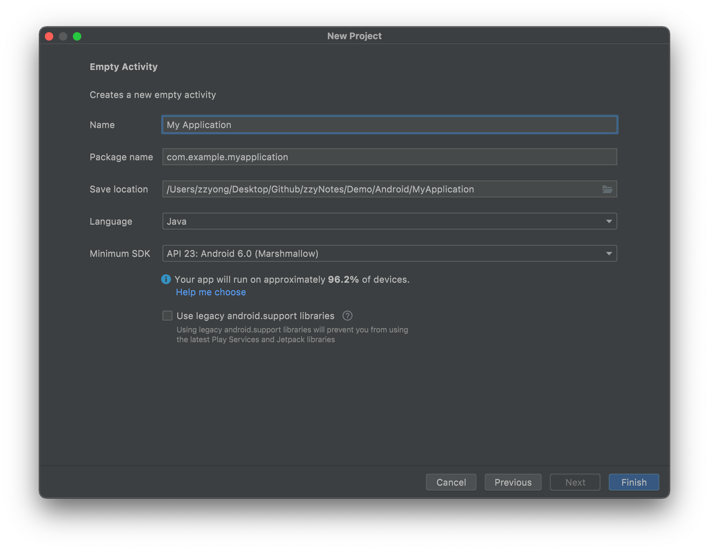
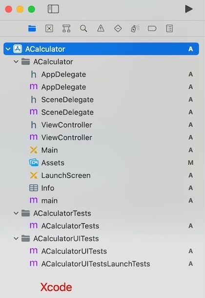
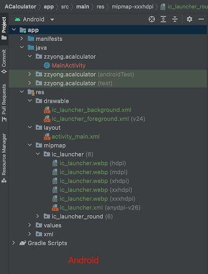

## 背景
突然想学习安卓开发来挑战一下自己，顺便检验下自己的学习能力，总之技多不压身，多学习下总是好的，这样以后在工作中讨论技术方案时可以有更多的灵感。作为一个在一线业务开发奋战了多年的程序员，想看看以自己多年的 iOS 开发经验是否能快速的入门 Android 开发。2022 先定一个小目标：写一个 Android 版的苹果计算器，2022 的总体目标也是学习并掌握 Android 开发。 努力努力！！！

## 准备
### 开发工具
- iOS：Xcode
- Android：[Android studio](https://developer.android.google.cn/studio/)

> 作为 iOS 开发，工具的初次使用体验，个人还是觉得 Xcode 更胜一筹...

### 工程创建
- Xcode 创建工程选择 App 模版即可，然后按照步骤设置下应用名和 bundle id 等，其他就不细说了
- Android studio 创建工程选择 Empty Activity 模版，然后进入 Configure your project 窗口配置下，如下所示

|类别|对比|
|---|---|
|**Name**|应用名，这个跟 iOS 没啥区别|
|**Package name**|包名，iOS 对应的是 bundle id|
|**Save location**|工程存储位置，没啥区别|
|**Language**|开发语言，iOS 也有 OC 和 Swift|
|**Minimum SDK**|应用支持的最低 Android 版本，跟 iOS 系统一致，但是让我惊喜的是，竟然还有设备占比提示，比 iOS 好|
|**Use legacy android.support libraries**|应用是否需要旧版库支持，勾选则表示需要，iOS没有这个|

### 工程对比
如下图所示

 

下面了解下工程里面的文件

|类别|作用|
|---|---|---|
|**MainActivity**|这是主 activity。它是应用的入口点。当您构建和运行应用时，系统会启动此 Activity 的实例并加载其布局。  iOS 里面对应的是 ViewController，iOS 这边是典型的 MVC 架构|
|**activity_main.xml**|定义了 activity 界面 (UI) 的布局，大概体验了下，跟 iOS 的 storyboard 大同小异，其实 storyboard 也是类似的 xml。iOS 里面对应的是 Main.storyboard |
|**AndroidManifest.xml**|清单文件描述了应用的基本特性并定义了每个应用组件，详情请参考：[应用清单概览](https://developer.android.google.cn/guide/topics/manifest/manifest-intro) iOS 里面与之对应的是 ACalculator.xcodeproj 文件|
|**Gradle Scripts**|Android Studio 构建系统配置脚本|

## 语言
应用的编程语言这边选择 java，至于为啥选 java？请看：[TIOBE 编程语言排行榜](https://www.tiobe.com/tiobe-index/)。语言入门教程：[Java 教程](https://www.liaoxuefeng.com/wiki/1252599548343744)

## UI 入门
Android 应用的界面 (UI) 以`布局`和`微件`的层次结构形式构建而成

- **布局：**布局是 ViewGroup 对象，即控制其子视图在屏幕上的放置方式的容器
- **微件：**微件是 View 对象，即按钮和文本框等界面组件

## 参考
- [Google 面向应用开发者的文档](https://developer.android.google.cn/docs)