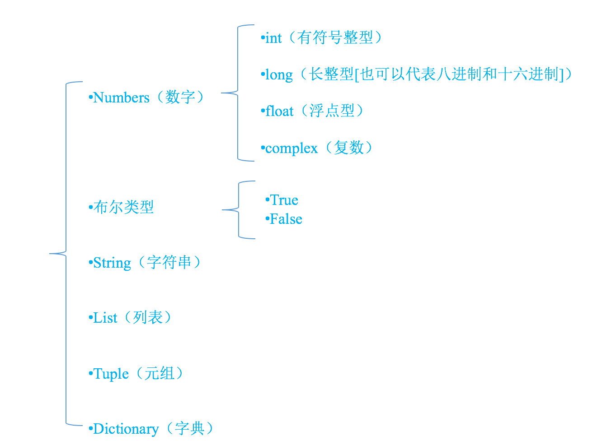

## python 基础语法

第一个python程序

```py
print('hello world')
```

### 注释
单行注释

```py
# 单行注释
print('hello world')
```

多行注释

```py
''' 
第一行注释
第二行注释
'''
print('hello world')
```

### 数据类型
- 变量类型无需指定，系统会自动辨别
- 使用`type(var name)`查看变量的类型

```py
>>> age = 18
>>> type(age)
<type 'int'>
```




### 标识符
- 只能由字母、下划线和数字组成，且数字不能开头
- 不能使用关键字
- 区分大小写字符
- 命名规则
	- 驼峰命名法：小驼峰(userName)；大驼峰(UserName)
	- 下划线法：user_name

### 关键字
查看当前系统中 python 的关键字

```py
>>> import keyword
>>> keyword.kwlist
[
'and', 'as', 'assert', 'break', 'class', 
'continue', 'def', 'del', 'elif', 'else', 
'except', 'exec', 'finally', 'for', 
'from', 'global', 'if', 'import', 'in', 
'is', 'lambda', 'not', 'or', 'pass', 
'print', 'raise', 'return', 'try', 
'while', 'with', 'yield'
]
```

### 输出
输出函数 print

```py
>>> print('hello world')
hello world
```

格式化输出：`%`

```py
>>> age = 18
>>> name = "xiao ming"
>>> print("姓名：%s 年龄：%d" %(name, age))
姓名：xiao ming 年龄：18
```

换行输出符：`\n`

```py
>>> print('123456\n7890')
123456
7890
```

常用的格式符号

|格式符号|转换|
|---|---|
|%c|字符|
|%s|字符串|
|%i|有符号十进制整数|
|%d|有符号十进制整数|
|%u|无符号十进制整数|
|%o|八进制整数|
|%x|十六进制整数（小写字母）|
|%X|十六进制整数（大写字母）|
|%f|浮点数|

### 输入
- `raw_input()`
	- 不支持表达式，用户输入的任何值都作为字符串
	- python3 没有 raw_input() 函数，只有 input() 
- `input()`
	- 输入必须是表达式

```py
>>> pwd = raw_input("输入密码：")
输入密码：111
>>> print(pwd)
>>> type(pwd)
<type 'str'>

>>> a = input("输入数字：")
输入数字：23
>>> type(a)
<type 'int'>

>>> a = input()
'q'+'w'
>>> print(a)
qw

# input()函数接受的输入必须是表达式
>>> a = input()
qqq
Traceback (most recent call last):
  File "<stdin>", line 1, in <module>
  File "<string>", line 1, in <module>
NameError: name 'qqq' is not defined
>>> a = input()
'qq'
>>> type(a)
<type 'str'>
```