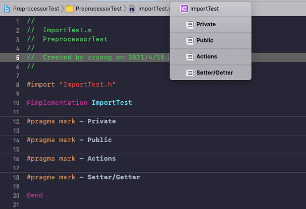

# Objective-C预处理器

Objective-C 预处理器不是编译器的组成部分，它是编译过程中一个单独的步骤。简言之，Objective-C 预处理器只是一个文本替换工具，它们会指示编译器在实际编译之前完成所需的预处理。

## 常见的预处理指令

### #define
宏定义
``` objc
#define MAX_NUM 100
```
### #import
包含源代码文件
```objc
#import <UIKit/UIKit.h>
#import "UserFile.h"
```

#### `#import< >` 与 `#import" "`的区别

- `< >`：引用标准库头文件，编译器从标准库目录开始搜索
- `" "`：引用非标准库的头文件，编译器从用户的工作目录开始搜索

#### `#import` 与 `#include` 的区别
#import 可以确保文件仅被引用一次

```objc
// build successed
#import "ImportTest.h"
#import "ImportTest.h"

// build error: Duplicate interface definition for class 'IncludeTest'
#include "IncludeTest.h"
#include "IncludeTest.h" 
```

### #ifdef 
如果宏已经定义，则返回真
### #if 
如果给定条件为真，则编译下面代码
### #endif
结束一个条件编译块
```objc
#if 1
        NSLog(@"DEBUG");
#else
        NSLog(@"RELEASE");
#endif
        
#ifdef DEBUG
        NSLog(@"DEBUG");
#else
        NSLog(@"RELEASE");
#endif
```

### #pragma
设定编译器的状态或者是指示编译器完成一些特定的动作，在日常开发中经常会使用 `#pragma mark` 划分方法

```objc
@implementation ImportTest

#pragma mark - Private

#pragma mark - Public

#pragma mark - Actions

#pragma mark - Setter/Getter

@end
```



### #warning
自定义编译器警告。一般用于标记一些未完成的功能和测试代码，防止忘记

```objc
#warning TODO by zzyong
```

### #error
自定义编译器错误，这会无法编译通过。例如可以使用其规避一些重复定义的问题

``` objc
// 去掉注释能编译通过吗？
//#define REDEFINE 1

#ifdef REDEFINE

#error redefine

#endif
```

## 预定义宏
系统定义了许多宏，下面列举一些常用的宏

|宏|描述|
|-|-|
|`__DATE__`|当前日期，一个以 "MMM DD YYYY" 格式表示的字符常量|
|`__TIME__`|当前时间，一个以 "HH:MM:SS" 格式表示的字符常量|
|`__FILE__`|当前文件路径，一个字符串常量|
|`__FILE_NAME__`|当前文件名，一个字符串常量|
|`__LINE__`|当前行号，一个十进制常量|
|`__FUNCTION__`|当前方法名，一个字符串常量|

```objc
NSLog(@"%s %s %s %d %s", __DATE__, __TIME__, __FILE_NAME__, __LINE__, __FUNCTION__);
NSLog(@"%s", __FILE__);

// log 
Apr 15 2021 21:42:59 main.m 49 main
/Users/zzyong/Desktop/Me/Github/zzyNotes/Demo/iOS/PreprocessorTest/PreprocessorTest/main.m
```

## 预处理器运算符
Objective-C 预处理器提供了下列的运算符来帮助你创建宏：

### `\` 运算符
宏延续运算符， 一个宏通常写在一个单行上。但是如果宏太长，一个单行容纳不下

```objc
#define MULTI_LINT_IMP if (idx == 1) {\
                            NSLog(@"1");\
                        } else if (idx == 2) {\
                            NSLog(@"2");\
                        } else {\
                            NSLog(@"3");\
                        }

void multiLineDefine(int idx)
{
//    if (idx == 1) {
//        NSLog(@"1");
//    } else if (idx == 2) {
//        NSLog(@"2");
//    } else {
//        NSLog(@"3");
//    }
    MULTI_LINT_IMP
}
```

### `#` 运算符
字符串常量化运算符，将宏的参数转换为字符串常量

```objc
#define  Hello(name) NSLog(@"Hello, %s", #name)

Hello(zzyong);

// Log
2021-04-16 11:27:36.822159+0800 PreprocessorTest[88847:8385706] Hello, zzyong

```

### `##` 运算符
标记粘贴运算符，将宏定义中两个独立的标记被合并为一个标记

```objc
#define Instance(name) instance##name

__unused int Instance(1) = 1;
__unused int Instance(2) = 2;

// 等价于 
__unused int instance1 = 1;
__unused int instance2 = 2;

```
