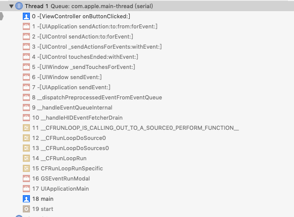
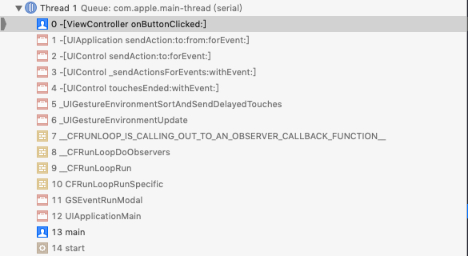

## UIButton 点击响应延迟
在一般的开发场景中，很难会遇到 UIButton 响应延迟的问题。就算遇到大多数都是因为主线程阻塞，这种问题很容易解决，接下来说说另外一种非常规延迟。


## 场景
测试主要代码如下：

```objc
#import "MyButton.h"

@implementation MyButton

- (UIView *)hitTest:(CGPoint)point withEvent:(UIEvent *)event
{
    NSLog(@"%s", __func__);
    
    return [super hitTest:point withEvent:event];
}

@end
```

``` objc
#import "ViewController.h"
#import "MyButton.h"

@interface ViewController ()

@property (weak, nonatomic) IBOutlet MyButton *aButton;

@property (weak, nonatomic) IBOutlet UIView *aView;

@property (assign, nonatomic) BOOL isAnimating;

@property (strong, nonatomic) UITapGestureRecognizer *doubleTapGesture;

@end

@implementation ViewController

- (void)viewDidLoad
{
    [super viewDidLoad];
    
    self.aView.layer.cornerRadius = self.aView.frame.size.width * 0.5;
    
    self.doubleTapGesture = [[UITapGestureRecognizer alloc] initWithTarget:self action:@selector(onDoubleTap:)];
//    self.doubleTapGesture.delaysTouchesEnded = NO;
//    self.doubleTapGesture.delegate = self;
    self.doubleTapGesture.numberOfTapsRequired = 2;
    [self.view addGestureRecognizer:self.doubleTapGesture];
}

- (void)onDoubleTap:(UITapGestureRecognizer *)doubleTapGesture
{
    NSLog(@"%s", __func__);
}

- (IBAction)onButtonClicked:(MyButton *)sender
{
    NSLog(@"%s", __func__);
    
    if (self.isAnimating) {
        return;
    }
    self.isAnimating = YES;
    
    [self startAnimation];
}

- (void)startAnimation
{
    self.aView.transform = CGAffineTransformIdentity;
    [UIView animateWithDuration:0.5 animations:^{
        self.aView.transform = CGAffineTransformMakeScale(1.3, 1.3);
    } completion:^(BOOL finished) {
        [UIView animateWithDuration:0.5 animations:^{
            self.aView.transform = CGAffineTransformIdentity;
        } completion:^(BOOL finished) {
            self.isAnimating = NO;
        }];
    }];
}

@end

```

### 场景一：UIButton
注释掉手势代码，点击按钮，日志输出如下：

```
2019-11-15 10:47:28.677167+0800 UIButtonDelayDemo[74007:2703683] -[MyButton hitTest:withEvent:]
2019-11-15 10:47:28.677383+0800 UIButtonDelayDemo[74007:2703683] -[MyButton hitTest:withEvent:]
2019-11-15 10:47:28.753206+0800 UIButtonDelayDemo[74007:2703683] -[ViewController onButton1Clicked:]
```
**结论：** Button 响应时间间隔: **76ms**

### 场景二：UIButton 与 单击 UITapGestureRecognizer
改为单击手势 `self.doubleTapGesture.numberOfTapsRequired = 1;` ，点击按钮，日志输出如下：

```
2019-11-15 10:52:34.546937+0800 UIButtonDelayDemo[73697:2687202] -[MyButton hitTest:withEvent:]
2019-11-15 10:52:34.547177+0800 UIButtonDelayDemo[73697:2687202] -[MyButton hitTest:withEvent:]
2019-11-15 10:52:34.636282+0800 UIButtonDelayDemo[73697:2687202] -[ViewController onButton1Clicked:]
```

**结论：** 从 Button 被确定为第一响应者到点击事件响应的时间间隔: **89ms**，点击正常响应，UI表现无延迟

### 场景三：UIButton 与 双击 UITapGestureRecognizer
改为双击手势 `self.doubleTapGesture.numberOfTapsRequired = 2;` ，点击按钮，日志输出如下：

```
2019-11-15 11:00:30.294756+0800 UIButtonDelayDemo[73944:2700167] -[MyButton hitTest:withEvent:]
2019-11-15 11:00:30.295125+0800 UIButtonDelayDemo[73944:2700167] -[MyButton hitTest:withEvent:]
2019-11-15 11:00:30.740430+0800 UIButtonDelayDemo[73944:2700167] -[ViewController onButton1Clicked:]
```

**结论：** 从 Button 被确定为第一响应者到点击事件响应的时间间隔为: **445ms**，点击异常响应，UI表现延迟明显。为什么 UIButton 的 superView 上存在双击手势时会造成其响应延时呢？原因如下。（**P.s**：以上场景的响应时间间隔跟多次测试取平均的结果相近，可自行验证）

## 分析
### UIButton 事件响应延迟具体原因如下：

1、手势的事件响应优先级比 UIButton 高。官方文档：[Using Responders and the Responder Chain to Handle Events](https://developer.apple.com/documentation/uikit/touches_presses_and_gestures/using_responders_and_the_responder_chain_to_handle_events)

> Gesture recognizers receive touch and press events before their view does. If a view's gesture recognizers fail to recognize a sequence of touches, UIKit sends the touches to the view. If the view does not handle the touches, UIKit passes them up the responder chain


2、双击手势会将 touch event 挂起一段时间（时间大概在**300 ~ 400ms**之间）用来分析其是否为双击事件，只有手势分析触摸事件结束之后才将挂起的 touch event 传给 View。此外， **`UIGestureRecognizer`** 的 **`delaysTouchesEnded`** 属性说明了一切

> default is YES. causes touchesEnded or pressesEnded events to be delivered to the target view only after this gesture has failed recognition. this ensures that a touch or press that is part of the gesture can be cancelled if the gesture is recognized

```objc
@property(nonatomic) BOOL delaysTouchesEnded;
```

> **Discussion**
> 
> When the value of this property is YES (the default) and the receiver is analyzing touch events, the window suspends delivery of touch objects in the UITouchPhaseEnded phase to the attached view. If the gesture recognizer subsequently recognizes its gesture, these touch objects are cancelled (via a touchesCancelled:withEvent: message). If the gesture recognizer does not recognize its gesture, the window delivers these objects in an invocation of the view’s touchesEnded:withEvent: method. Set this property to NO to have touch objects in the UITouchPhaseEnded delivered to the view while the gesture recognizer is analyzing the same touches.

### UIButton 事件响应调用栈差异
对比可知：单/双击中的事件传递是不一样的，双击手势调用栈中多了一些手势相关的调用 \_UIGestureEnvironmentSortAndSendDelayedTouches:

#### 单击手势调用栈



#### 双击手势调用栈



## 解决

由上面的分析可知：手势会挂起触摸事件直到其分析结束后才将事件继续传递给 View，那么只需要将 delaysTouchesEnded 设置为 NO 即可，这样子在双击手势分析触摸事件期间就可以把该事件传给对应的 View，互不干扰。代码如下：

```objc
self.doubleTapGesture.delaysTouchesEnded = NO;
```
设置后的按钮响应正常，日志打印如下：

```
2019-11-15 17:24:05.459630+0800 UIButtonDelayDemo[1458:416963] -[MyButton hitTest:withEvent:]
2019-11-15 17:24:05.460181+0800 UIButtonDelayDemo[1458:416963] -[MyButton hitTest:withEvent:]
2019-11-15 17:24:05.526318+0800 UIButtonDelayDemo[1458:416963] -[ViewController onButtonClicked:]
```

**设置为 NO 后，双击按钮，会出现按钮和双击手势同时响应的问题**。如果双击手势的响应和按钮点击之间有冲突，那么还需要判断下改手势是否可以接收该 `touch`。代码如下：

```objc
self.doubleTapGesture.delegate = self;

#pragma mark - UIGestureRecognizerDelegate

- (BOOL)gestureRecognizer:(UIGestureRecognizer *)gestureRecognizer shouldReceiveTouch:(UITouch *)touch
{
    if ([touch.view isEqual:self.aButton]) {
        return NO;
    }
    
    return YES;
}
```

## 结尾
本文到此就结束了，虽然这是一个很简单的问题，但是业务上的复杂可能使其变成一个复杂的问题。

**测试代码**：[UIButtonDelayDemo](https://github.com/zhiyongzou/zzyNotes/blob/main/Demo/iOS/UIButtonDelayDemo)

## 参考文档
1. [Using Responders and the Responder Chain to Handle Events](https://developer.apple.com/documentation/uikit/touches_presses_and_gestures/using_responders_and_the_responder_chain_to_handle_events)
2. [Handling UIKit Gestures](https://developer.apple.com/documentation/uikit/touches_presses_and_gestures/handling_uikit_gestures)
