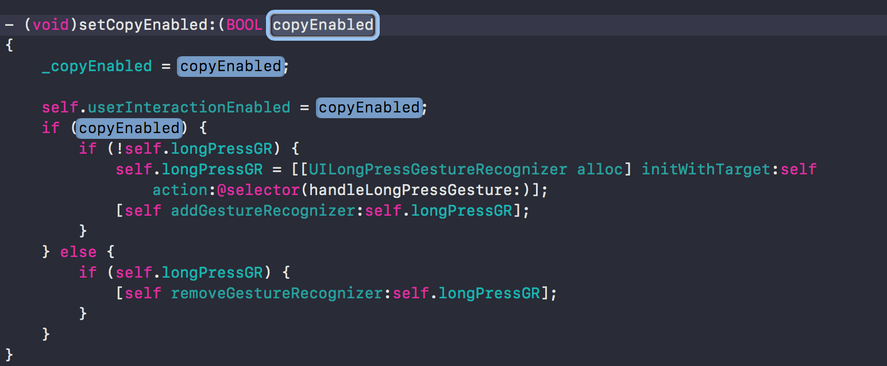
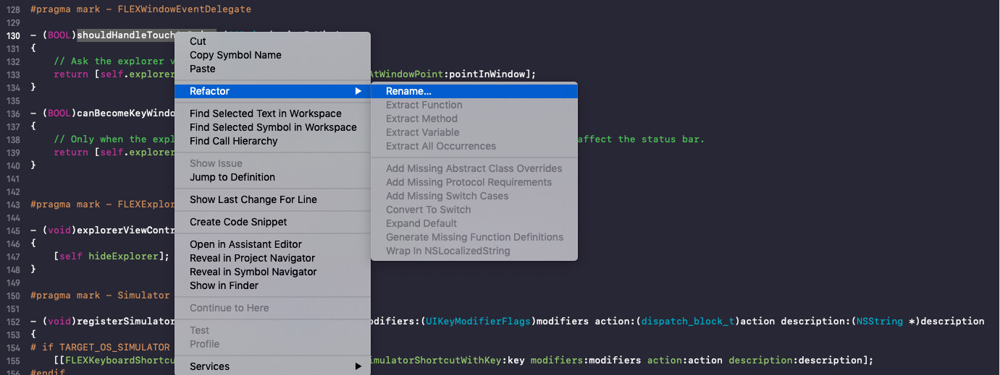
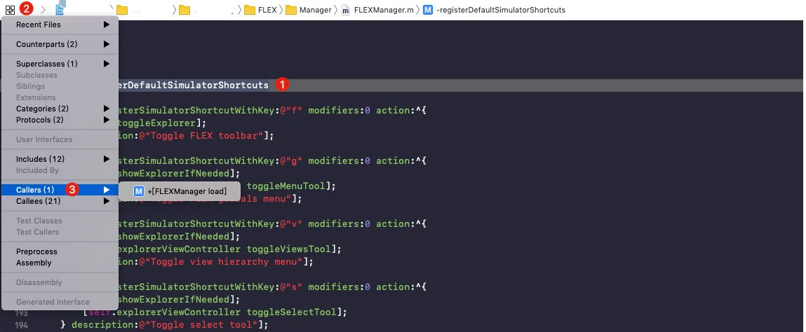

## Xcode的一些使用技巧

##### 方法注释快捷键
> option + command + /

##### 快速查找文件位置
> shift + command + o

##### 快速定位当前文件在工程目录所处位置
> shift + command + j

##### `[ `选中内容上移，`] `选中内容下移
> option + command + [ ]

##### 快速切换 **.h** 和 **.m**
> control + command + ↑ ↓

##### 快速批量修改选中文本
> control + command + e
> 
> 

##### 方法属性重命名
> 

##### 方法调用查找
> 
