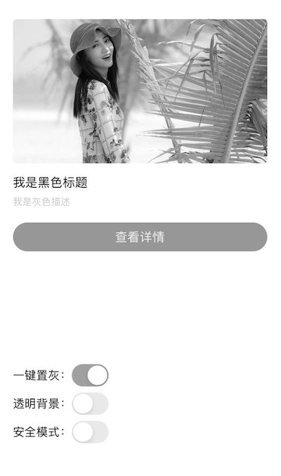
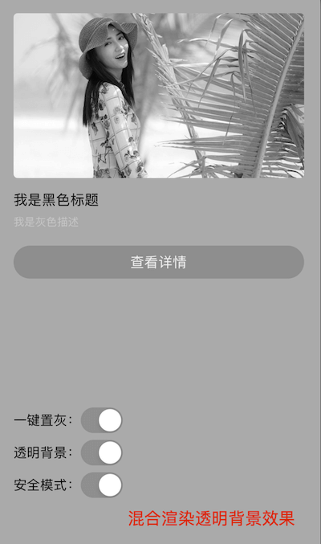

## iOS UI 一键置灰

### 背景
为了满足各种政策性的要求，有时候需要将 App 的特定页面进行置灰，例如：首页。

### 方案
#### 方案 1：CALayer 的混合滤镜 `compositingFilter`
1. 优点：
	- 作用于视图本身及其子视图(UIView, UILable, UIImageView...)，无需逐个设置
	- 系统支持，无审核风险
2. 缺点：
	- **iOS 13**及以上才支持此功能
	- 如果目标视图背景色为透明色会出现**灰色蒙层**，效果不佳

代码如下

```objc
- (void)gm_safeSetGrayMask:(BOOL)hasMask {
    if (@available(iOS 13.0, *)) {
        UIView *grayView = [self gm_garyMaskView];
        if (hasMask && !grayView) {
            grayView = [UIView new];
            grayView.backgroundColor = UIColor.lightGrayColor;
            grayView.userInteractionEnabled = NO;
            grayView.layer.compositingFilter = @"saturationBlendMode";
            [self gm_setGrayMaskView:grayView];
            [self addSubview:grayView];
        }
        if (hasMask && grayView) {
            [self bringSubviewToFront:grayView];
            grayView.frame = self.bounds;
        }
        grayView.hidden = !hasMask;
    }
}

- (nullable UIView *)gm_garyMaskView {
    return objc_getAssociatedObject(self, _cmd);
}

- (void)gm_setGrayMaskView:(UIView *)view {
    objc_setAssociatedObject(self, @selector(gm_garyMaskView), view, OBJC_ASSOCIATION_RETAIN_NONATOMIC);
}
```

#### 方案 2：私有滤镜 `CAFilter`
1. 优点：
	- 作用于视图本身及其子视图(UIView, UILable, UIImageView...)，无需逐个设置
	- 目前大部分 App 基本都只支持 iOS 11及以上了，所以系统版本基本无限制
	- 对视图背景色无限制，支持透明色背景
2. 缺点：
	- 私有类，需要规避可能的审核风险（**经实验，无审核风险**）

代码如下

```objc
/// 由于是私有类，为了避免审核风险，需要进行字符串拼接规避扫描，该方案已正常上线
/// 如果觉得字符串拼接不够稳妥，可以考虑由服务端下发，并且在审核期间屏蔽下发
/// 或者使用字符串加密方式进行规避
- (void)gm_setGrayMask:(BOOL)hasMask {
    if (hasMask) {
        @try {
            NSString *cls = [@"CA" stringByAppendingString:@"Filter"];
            CIFilter *gray = [NSClassFromString(cls) filterWithName:@"colorSaturate"];
            [gray setValue:@0 forKey:@"inputAmount"];
            self.layer.filters = @[gray];
        } @catch (NSException *exception) { }
    } else {
        self.layer.filters = nil;
    }
}

```

### 结论
1. 如果项目本身只支持 iOS13 及以上，且没有透明背景的前提下，选择方案 1 也可以
2. 建议选择方案 2，无限制，效果好，也没有审核风险【推荐】🔥🔥🔥

### 代码
[https://github.com/zhiyongzou/zzyNotes/blob/main/Demo/iOS/GrayUI](https://github.com/zhiyongzou/zzyNotes/blob/main/Demo/iOS/GrayUI)

### 效果


