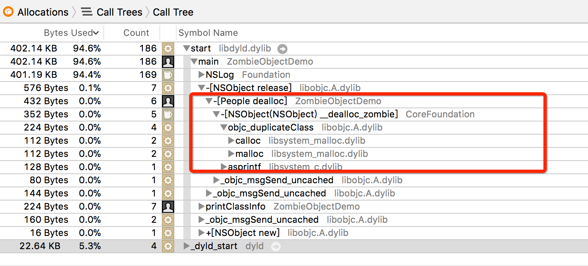

# iOS Zombie Objects 原理探索

### Zombie Object 有什么用
* 僵尸对象一种用来检测内存错误`(EXC_BAD_ACCESS)`的对象，它可以捕获任何对尝试访问坏内存的调用。 
* 如果给僵尸对象发送消息时，那么将在运行期间崩溃和输出错误日志。通过日志可以定位到野指针对象调用的方法和类名。

### 如何开启 Zombie Object 检测
在 Xcode 中设置`Edit Scheme -> Diagnostics -> Zombie Objects`

### 开启 Zombie Object 检测后，对象调用 dealloc 方法会发生变化
1、新建一个终端工程 (Command Line Tool)，具体代码如下：

``` objc
void printClassInfo(id obj)
{
    Class cls = object_getClass(obj);
    Class superCls = class_getSuperclass(cls);
    NSLog(@"self:%s - superClass:%s", class_getName(cls), class_getName(superCls));
}

int main(int argc, const char * argv[]) {
    @autoreleasepool {
        
        People *aPeople = [People new];
        
        NSLog(@"before release!");
        printClassInfo(aPeople);
      
        [aPeople release];
        
        NSLog(@"after release!");
        printClassInfo(aPeople);
    }
    return 0;
}

```
2、开启 Zombie Objects

3、运行程序，查看打印信息。从打印信息可以看到开启僵尸对象检测后，People 释放后所属类变成了`_NSZombie_People`。如此可得对象释放后会变成僵尸对象，保存当前释放对象的内存地址，防止被系统回收。


``` objc
ZombieObjectDemo[1357:84410] before release!
ZombieObjectDemo[1357:84410] self:People - superClass:NSObject
ZombieObjectDemo[1357:84410] after release!
ZombieObjectDemo[1357:84410] self:_NSZombie_People - superClass:nil

```

**Tip:**

> 这边其实可以看到 \_NSZombie\_People 是没有父类的，是一个根类，并没有实现任何方法，因此所有发送给僵尸类的消息都要经过完整的消息转发机制。这也是触发僵尸对象机制会断点在 \_\_\_forwarding\_\_\_ 的原因。不是很理解的话，可以试试给 NSProxy 对象发消息


4、结下来打开 instruments -> Zombies ,查看 dealloc 究竟做了什么。点击运行，查看 Call trees。结果如下图，从 dealloc 的调用可以知道：Zombie Objects hook 住了对象的 dealloc 方法，通过调用自己的`__dealloc_zombie`方法来把对象进行僵尸化。在 Runtime 源码 NSObject.mm 文件中 dealloc 方法注释中也有说明这一点。如下：

```objc
// Replaced by NSZombies
- (void)dealloc {
    _objc_rootDealloc(self);
}
```

由对象 dealloc 方法调用栈（ Call Tree ）很好的验证了步骤 3 的打印信息。那么这个过程又是怎么样的？继续探索。


	
### Zombie Object 的生成过程是怎么样的
1、创建 **`__dealloc_zombie`** 符号断点来看一探究竟

```objc
CoreFoundation`-[NSObject(NSObject) __dealloc_zombie]:
    0x7fff3fa2dee7 <+23>:  leaq   0x5a59c4a2(%rip), %rax    ; __CFZombieEnabled
    0x7fff3fa2defa <+42>:  callq  0x7fff3fa7d930            ; symbol stub for: object_getClass
    0x7fff3fa2df0a <+58>:  callq  0x7fff3fa7d486            ; symbol stub for: class_getName
    0x7fff3fa2df12 <+66>:  leaq   0x237d1b(%rip), %rsi      ; "_NSZombie_%s"
    0x7fff3fa2df2b <+91>:  callq  0x7fff3fa7d8b8            ; symbol stub for: objc_lookUpClass
    0x7fff3fa2df38 <+104>: leaq   0x2376a9(%rip), %rdi      ; "_NSZombie_"
    0x7fff3fa2df3f <+111>: callq  0x7fff3fa7d8b8            ; symbol stub for: objc_lookUpClass
    0x7fff3fa2df4d <+125>: callq  0x7fff3fa7d870            ; symbol stub for: objc_duplicateClass
    0x7fff3fa2df61 <+145>: callq  0x7fff3fa7d86a            ; symbol stub for: objc_destructInstance
    0x7fff3fa2df6c <+156>: callq  0x7fff3fa7d948            ; symbol stub for: object_setClass 
```


从此处断点可以大概看出 **Zombie Object** 的生成过程。**`_NSZombie_%s`** 验证了开启僵尸对象检测后的对象所指向的类。从这个调用栈也可以说明系统开启僵尸对象检测后不会释放该对象所占用的内存，只是释放了与该对象所有的相关引用。让 **Runtime** 源码告诉你：


``` objc
/***********************************************************************
* object_dispose
* fixme
* Locking: none
**********************************************************************/
id object_dispose(id obj)
{
    if (!obj) return nil;

    objc_destructInstance(obj);    
    free(obj);

    return nil;
}
```


上面是为开启僵尸对象检测对象释放的调用过程，开启僵尸对象检测后将没有 **free(obj)** 这一步的调用，而是执行 **objc_destructInstance(obj)** 方法后就直接 return 了。我们也可以看看 objc_destructInstance 到底都干了些什么。从其注释可以知道该方法做了下面几件事：**【C++ destructors】【ARC ivar cleanup】【Removes associative references】** 并没有释放其内存。

``` objc
//***********************************************************************
* objc_destructInstance
* Destroys an instance without freeing memory. 
* Calls C++ destructors.
* Calls ARC ivar cleanup.
* Removes associative references.
* Returns `obj`. Does nothing if `obj` is nil.
**********************************************************************/
void *objc_destructInstance(id obj) 
{
    if (obj) {
        // Read all of the flags at once for performance.
        bool cxx = obj->hasCxxDtor();
        bool assoc = obj->hasAssociatedObjects();

        // This order is important.
        if (cxx) object_cxxDestruct(obj);
        if (assoc) _object_remove_assocations(obj);
        obj->clearDeallocating();
    }

    return obj;
}
```

从汇编的调用顺序可以大概总结出僵尸对象的生成过程，如下：

```objc
// 获取到即将deallocted对象所属类（Class）
Class cls = object_getClass(self);
	
// 获取类名
const char *clsName = class_getName(cls)
	
// 生成僵尸对象类名
const char *zombieClsName = "_NSZombie_" + clsName;
	
// 查看是否存在相同的僵尸对象类名，不存在则创建
Class zombieCls = objc_lookUpClass(zombieClsName);
if (!zombieCls) {
    // 获取僵尸对象类 _NSZombie_
    Class baseZombieCls = objc_lookUpClass(“_NSZombie_");
		
    // 创建 zombieClsName 类
    zombieCls = objc_duplicateClass(baseZombieCls, zombieClsName, 0);
}

// 在对象内存未被释放的情况下销毁对象的成员变量及关联引用。
objc_destructInstance(self);
	
// 修改对象的 isa 指针，令其指向特殊的僵尸类
objc_setClass(self, zombieCls);
```

### Zombie Object 是如何被触发的
1、再次调用 **[aPeople release]** 可以看到程序断在 **`___forwarding___`**，从此处的汇编代码中可以看到关键字 **`_NSZombie_`** ，在调用 **abort( )** 函数退出进程时会有对应的信息输出` @"*** -[%s %s]: message sent to deallocated instance %p"`。


```objc
CoreFoundation`___forwarding___:
    0x7fff3f90b1cd <+269>:  leaq   0x35a414(%rip), %rsi      ; "_NSZombie_"
```


为此也可以大概总结出它的调用过程，如下：

```objc
// 获取对象class
Class cls = object_getClass(self);
	
// 获取对象类名
const char *clsName = class_getName(cls);
	
// 检测是否带有前缀_NSZombie_
if (string_has_prefix(clsName, "_NSZombie_")) {
    // 获取被野指针对象类名
    const char *originalClsName = substring_from(clsName, 10);
	 
    // 获取当前调用方法名
    const char *selectorName = sel_getName(_cmd);
	　　
    // 输出日志
    Log(''*** - [%s %s]: message sent to deallocated instance %p", originalClsName, selectorName, self);
		
    // 结束进程
    abort();
}
```

### 结论
1. 系统在回收对象时，可以不将其真的回收，而是把它转化为僵尸对象。这种对象所在的内存无法重用，因此不可遭到重写，所以将随机变成必然。

2. 系统会修改对象的 isa 指针，令其指向特殊的僵尸类，从而使该对象变为僵尸对象。僵尸类能够相应所有的选择器，响应方式为：打印一条包含消息内容及其接收者的消息，然后终止应用程序。
