# iOS 调试技巧

## 前言
作为一个合格的 iOS 程序员，掌握一些基础的调试技巧，不但有利于提升解决问题的效率，而且也有利于发现问题的本质。下面就简单介绍日常开发中可能用到的一些调试技巧。

## 断点 (Breakpoint)
断点用来暂停程序运行，实时查看符号和对象。Xcode 支持多种不同类型的断点。例如：Swift 错误断点、异常断点、符号断点等。下面就来介绍一些断点的使用场景。

### Exception Breakpoint
你会不会经常遇到过下面这个崩溃场景：直接崩在 main 函数。

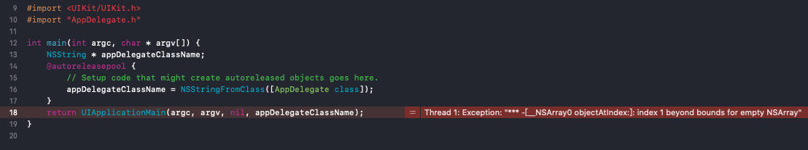

这是一个数组越界问题，但却崩在了 `main` 函数，所以定位该问题可能需要浪费一些的时间。此时，你需要一个 Exception Breakpoint，它可以帮你快速定位到异常代码位置。设置方式：`Debug -> Breakpoints -> Creat Exception Breakpoint`。或者在断点导航栏处直接创建

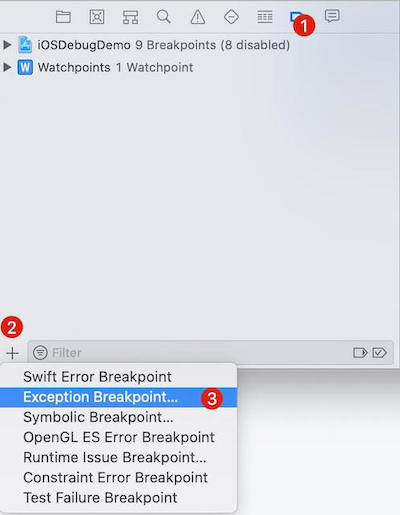

设置了 Exception Breakpoint 后，崩溃就直接定位到具体的崩溃代码行了。是不是很爽。建议一直开启异常断点。

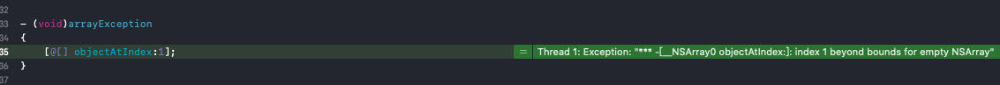

上面抛出异常时控制台是没有对应的错误信息输出的。下面介绍一个小技巧，在异常断点里面加一个 LLDB 命令：`po $arg1`。因为 `objc_exception_throw` 第一个参数就是异常信息本身，所以控制台就会打印出该异常对象。具体如下图所示

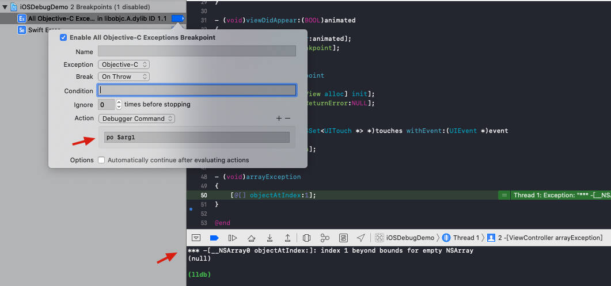

### Swift Error Breakpoint
Swift 的错误抛出并不是传统意义的 Exception，在调试时抛出错误不会触发 Exception 断点。如果你需要 `throw` 语句执行的时候暂停程序，那么你需要设置一个 Swift Error Breakpoint。它会在 `swift_willThrow`上添加一个断点

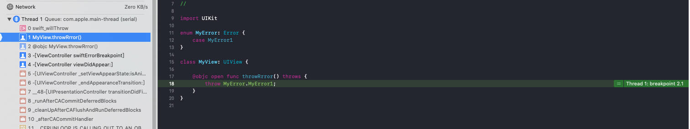

### Symbolic Breakpoint
符号断点会在执行到特定符号时暂停程序。符号断点设置方式：`Debug -> Breakpoints -> Creat Symbolic Breakpoint`, 或者如下图方式进行创建。

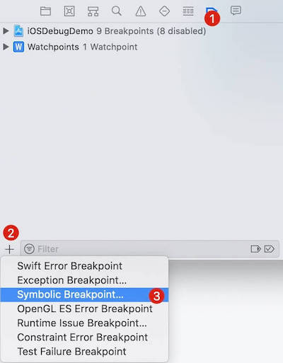

设置好符号断点后需要进行编辑，在 Symbol 填入符号，符号有以下几种：

- **方法名**，其会暂停所有该符号的调用。例如: `removeFromSuperview`，只要调用了`removeFromSuperview` 就会暂停程序执行
- **类的一个方法**。例如: `-[MyView1 removeFromSuperview]`
- **C 函数**。例如: `c_func`

进入编辑方式：选中断点导航面板中设置的符号断点，点击右键，选择 `Edit Breakpoint` 即可进入下图编辑面板

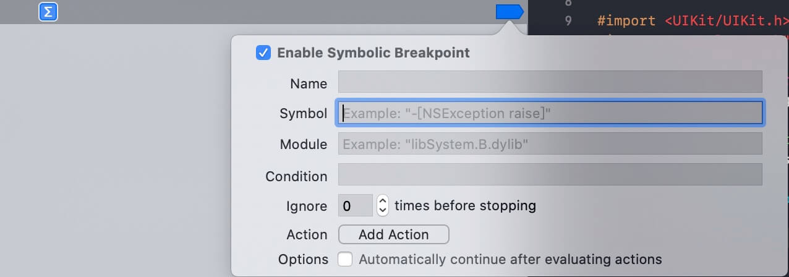

编辑面板可以看到还有一个 `Moudle` 选项，它可以指定特定模块（库）中的符号。这个可以在设置**`方法名符号`**时指定特定库的符号。例如：`UIKitCore`，那么只有当`UIKitCore`中的 `removeFromSuperview` 才会进入断点。

符号断点可以在一些复杂业务和探索系统调用的场景下起到重要作用。例如有个 UIView 视图有多处对其进行了 `removeFromSuperview` 调用。如果你想了解其所有移除场景。那么你需要一个符号断点来协助你。这里有个注意的点就是在该类中必须有对应的方法实现。例如：`-[MyView1 removeFromSuperview]` 就需要在 `MyView1` 中重写 `removeFromSuperview` 方法，否则无法进入该符号断点。本人就利用过符号断点解决过一个 `videoView` 被误移除的 Bug。

### Constraint Error Breakpoint & Test Failure Breakpoint
这两种断点在实际开发当中使用的比较少。下面就简单介绍下其作用

- `Constraint Error Breakpoint`：是一个自动布局约束错误断点，其可以帮你快速定位自动布局错误；
- `Test Failure Breakpoint`：是一个单元测试/UI测试失败断点，当测试失败时会直接暂时程序，其可以帮你快速定位测试失败原因

### 断点编辑（Edit Breakpoint）
通常，断点会在每次执行到该行代码时会停止程序，进入调试模式。可能有的时候并不需要每次执行都暂停程序，例如设置断点执行条件；或者你需要在进入该断点时执行一些特定的操作，例如自定义输出、打印变量等自定义操作。下图就是简单设置一个在 `idx == 2` 进入断点，并且自定义了一些自定义输出。

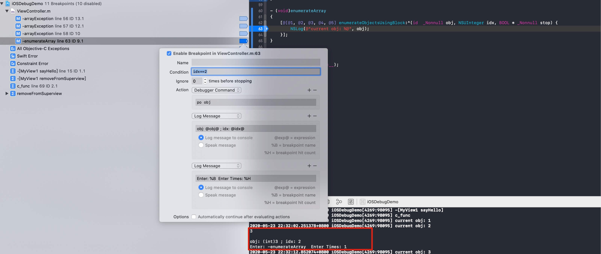

从上图可以看出还有一个 `Automatically continue after evaluation actions` 选项，它被勾选的时，进入该断点会执行对应的操作后继续运行程序，并不会暂停程序执行。看到这里有木有灵光一闪！！！其实我们完全可以利用这个代替 `NSLog` 函数去进行一些日志输出。下面举一个例子。

> 例如在某次的调试中，你需要知道 firstChar 的值。但是尴尬的是并没有进行日志输出（如下示例代码）。 常规的解决方案就是加上日志输出，然后重新编译运行App。但是这种方案无疑浪费了老司机的宝贵时间。 

```objc
- (void)logMag:(NSString *)msg
{
    __unused NSString *firstChar = [msg substringToIndex:1];
}
```

此时你需要一个自定义断点来帮助你。

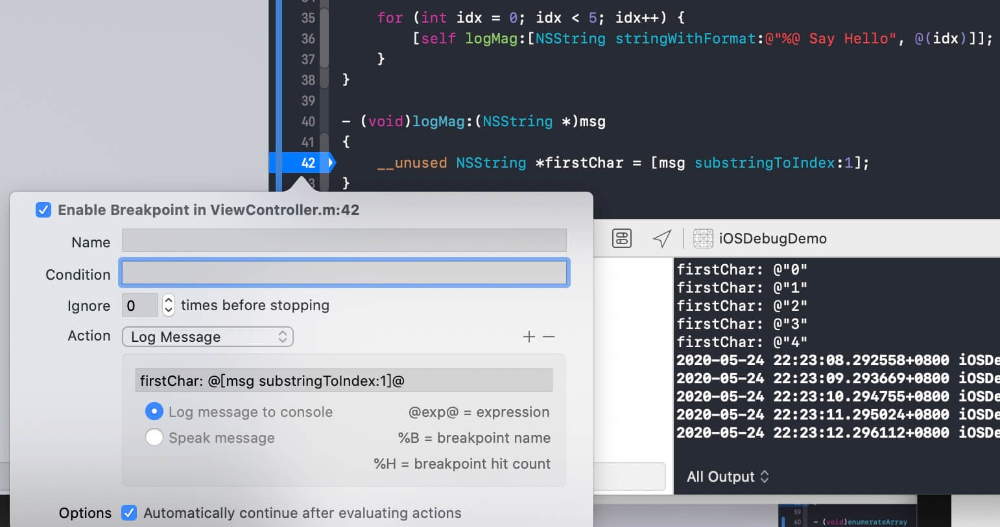

此外，`Action` 还支持执行脚本、播放音频、捕获 OpenGL ES 帧等操作。具体的可以自行进行测试。

## 观察点 (Watch Point)
观察点可以在某个变量中保存的值发生变化时暂停程序的执行。观察点可帮助解决与**全局变量 / 单例对象**有关的问题，追踪具体是哪个方法改变了特定的全局变量。此外，不能在程序未运行时添加观察点，必须在进入调试状态时在变量观察窗口进行观察点设置。具体设置方式：`Watch "var"`。

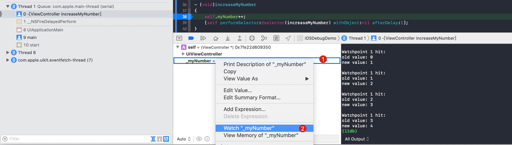

## 启动调试 (Wait for the executable to be launched)
有时后我们需要调试一些外部唤起 App 的启动信息，例如从其它 App 唤起自己的 App。这个时候就不能  Xcode 编译完就立马运行 App，我们需要等外部唤醒来运行 App，否则无法捕获启动信息。设置方式如下：


## 进程调试 (Attach To Process)
很多时候 QA 可以比较容易重现一些概率 Bug 场景，但是作为程序猿的你可能一次也无法重现。此情此景，你只能暗自懊恼为啥没有 QA 那单身几十年的手速。

`Attach To Process` 可以帮你解决概率 Bug 重现问题。它可以帮你调试正在运行的进程（App）。因此，你可以将你的测试机交给你的 QA，让 QA 帮你重现 Bug。Bug 重现后，只要将测试机连接 Xcode，（注意App运行的代码必须和本地代码是一致的），找到对应的进程点击`Attach To Process`即可进入断点调试。具体设置方式：`Debug -> Attach To Process -> Your App Process`。模拟器示例如下：

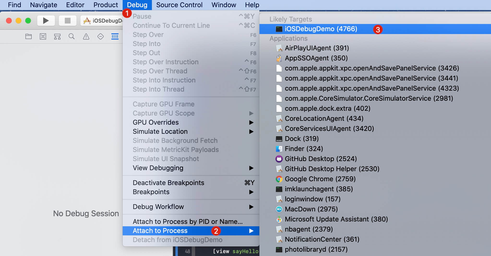

## LLDB (Low Level Debugger)
LLDB 是 Xcode 内置动态调试工具。在程序进入断点时，Xcode 的调试控制台就会进入 LLDB 命令行调试状态。此时你可以在 Xcode 控制台中输入 LLDB 调试命令符来协助调试，其还可以执行额外的 Python 脚本。下面介绍一些常用的 LLDB 指令的使用。

### 打印对象和标量
LLDB 最常用的命令就是 `po (print object)`, 意为打印对象。po 可以打印当前作用域下的所有变量。例如：

```bash
(lldb) po self
```

如果你需要打印一些标量(非对象)时，此时要用 `p`，而不是 `po`。例如：

```bash
(lldb) p (CGRect) self.view.bounds
(lldb) p (NSUInteger) self.myNumber
```

使用 po 还可以直接改变程序运行中的变量值。例如：`self.myNumber = 10`

```bash
(lldb) po self.myNumber = 10
```

### 打印寄存器
CPU 寄存器中保存了跟程序状态有关的大量信息，知道寄存器中的值可以大大减少你的调试时间，帮你迅速定位到问题原因。 寄存器用来存储常用的变量。编译器会对循环变量、方法参数及返回值等常用变量进行优化，将其放在寄存器中。当应用崩溃了但是没有明显的原因时，查看寄存器中保存的那些导致引用崩溃的方法名和参数值会很有用。

使用`register read`命令来打印寄存器。你也可以打印特定寄存器的值，例如：`register read rcx`。下面是模拟器的寄存器输出示例。

```bash
(lldb) register read
General Purpose Registers:
       rax = 0x00007fff48525c5f  UIKitCore`-[UIViewController _setViewAppearState:isAnimating:] + 851
       rbx = 0x0000000000000148
       rcx = 0x00007fff48525fb4  UIKitCore`-[UIViewController _setViewAppearState:isAnimating:] + 1704
       rdx = 0x0000000000000001
       rdi = 0x00007fb215507480
       rsi = 0x00007fff51df2675
       rbp = 0x00007ffeee505a10
       rsp = 0x00007ffeee5059e0
        r8 = 0x00007fff89c8aa30  libsystem_pthread.dylib`_pthread_keys
        r9 = 0x0000000000000380
       r10 = 0x0000000100000000
       r11 = 0x00000001016f8610  iOSDebugDemo`-[ViewController viewDidAppear:] at ViewController.m:26
       r12 = 0x00007fff50ad3400  libobjc.A.dylib`objc_msgSend
       r13 = 0x00007fb215507480
       r14 = 0x0000000000000002
       r15 = 0x00007fb215508710
       rip = 0x00000001016f8626  iOSDebugDemo`-[ViewController viewDidAppear:] + 22 at ViewController.m:28:5
    rflags = 0x0000000000000202
        cs = 0x000000000000002b
        fs = 0x0000000000000000
        gs = 0x0000000000000000

(lldb) register read rcx
     rcx = 0x00007fff48525fb4  UIKitCore`-[UIViewController _setViewAppearState:isAnimating:] + 1704
(lldb)
```

### 打印 UIView / UIViewController 层级
- `UIView` 的私有方法 `recursiveDescription` 可以输出其视图层级
- `UIViewController` 的私有方法 `_printHierarchy` 可以输出其控制器层级

```bash
lldb) po [self.view recursiveDescription]
<UIView: 0x61300000cd00; frame = (0 0; 375 667); autoresize = W+H; layer = <CALayer: 0x6030000ab160>>
   | <MyView1: 0x61300003ecc0; frame = (0 0; 0 0); layer = <CALayer: 0x6030000c47b0>>

(lldb) po [self _printHierarchy]
<ViewController 0x618000007080>, state: appeared, view: <UIView 0x61300000cd00>
 
```

### Python 脚本
LLDB 支持导入 Python 脚本来帮助调试。这边推荐一个超级好用的 Python 调试脚本：[Chisel](https://github.com/facebook/chisel)。它绝对可以极大提高你的调试效率

## 内存调试
### Address Sanitizer
Address Sanitizer 不但可在运行时查找内存损坏和其他内存错误，而且性能开销也小。它是一些概率内存错误崩溃的克星，如果你在尝试重现崩溃时开启 Address Sanitizer，那么恭喜你！你已经成功迈出一大步了。Address Sanitizer 可以检测以下内存问题：

- 使用已释放的内存：Use after free
- 堆缓冲区溢出：Heap buffer overflow
- 栈缓冲区溢出：Stack buffer overflow
- 全局变量溢出：Global variable overflow
- C++ 容器溢出(集合越界)：Overflows in C++ containers
- 使用已回收的栈内存：Use after return

```objc
int global_array[10] = {0, 1, 2, 3, 4, 5, 6, 7, 8, 9};
void foo() {
    int idx = 10;
    // Error: out of bounds access of global variable
    global_array[idx] = 42; 
    
    char *heap_buffer = malloc(10);
    // Error: out of bounds access of heap allocated variable
    heap_buffer[idx] = 'x'; 
    
    char stack_buffer[10];
    // Error: out of bounds access of stack allocated variable
    stack_buffer[idx] = 'x'; 
}


int *integer_pointer_returning_function() {
    int value = 42;
    return &value;
}

// Use after return
int *integer_pointer = integer_pointer_returning_function();
// Error: invalid access of returned stack memory
*integer_pointer = 43;
```

开启方式：`Product -> Scheme -> Edit Scheme -> Diagnostics -> Address Sanitizer`。

### Zombie Objects

* Zombie Objects 一种用来检测内存错误(`EXC_BAD_ACCESS`)的对象，它可以捕获任何对尝试访问坏内存的调用。 
* 如果给 Zombie Objects 发送消息时，那么将在运行期间崩溃和输出错误日志。通过日志可以定位到野指针对象调用的方法和类名。

开启方式：`Product -> Scheme -> Edit Scheme -> Diagnostics -> Zombie Objects`。

### Memory Graph
Memory Graph 可以帮助我们查找和修复泄漏和废弃的内存，它有点类似于 View Hierarchy，它可以很方便的查看对象的引用关系，而且该对象存在内存泄漏，那么该对象则会被标记上**感叹号(!)**。

开启 Memory Graph 时程序会暂停执行，并且显示存活在堆上的对象以及对象的引用关系链。开启方式如下：


开启后的对象内存引用图如下。

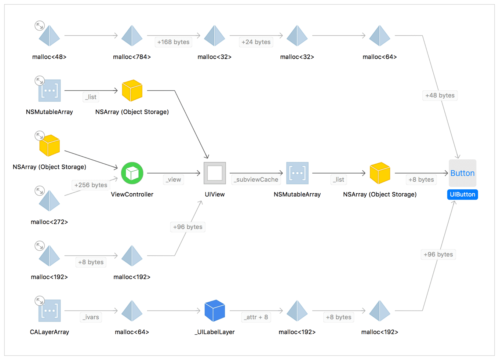

## UI调试
### View Hierarchy
`View Hierarchy`是一款强大的 3D 视图层级调试工具，其可以很方便的查看 App 的视图层级以及布局约束，可以帮你解决一些常见的UI问题。例如：视图遮挡、视图裁剪、视图错位、视图内容错误等。（Ps：用来快速熟悉业务也是非常 Nice 的！！！）

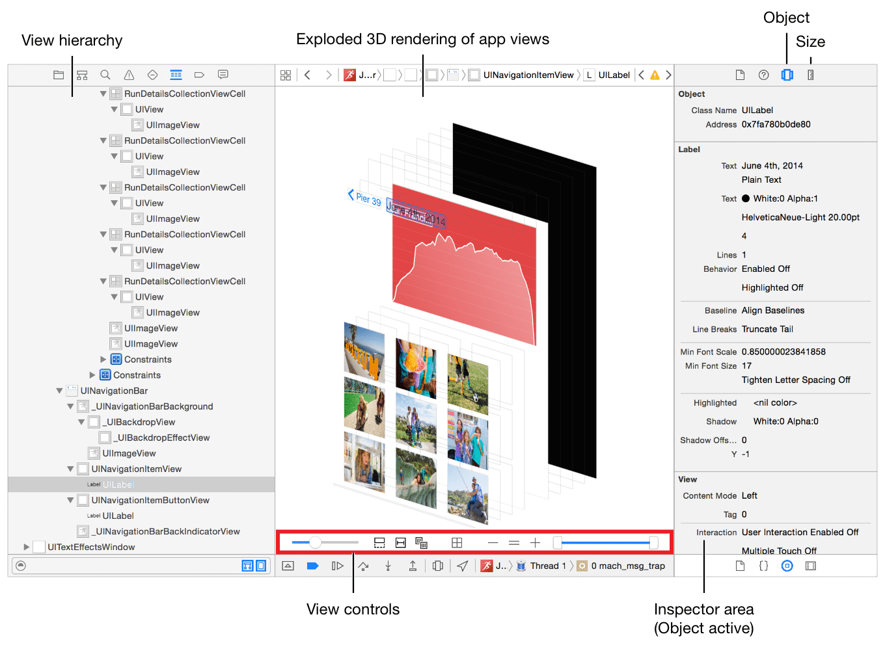

开启 View Hierarchy 有以下两种方式：

-  `Debug -> View Debugging -> Capture View Hierarchy`
- 点击调试栏中的 View Hierarchy 按钮


### FLEX
FLEX 是一款内置在 App 内的调试和探索工具集。下面列举其一些功能，具体使用和详细功能请移步至：**[FLEX](https://github.com/Flipboard/FLEX)**

- 检查和修改视图层级树中的视图
- 查看任何对象的属性和变量
- 动态修改属性和变量
- 动态调用实例和类方法
- 查看详细的网络请求历史记录以及时间，消息头和完整响应
- 查看系统日志消息，例如 NSLog
- 查看应用程序沙箱中的文件系统
- 浏览文件系统中的SQLite / Realm数据库
- ...

与许多其他调试工具不同的是，FLEX 是在应用程序内部运行，因此无需暂停程序即可进行调试，这一点比 View Hierarchy 方便不少。只要你开始使用 FLEX，相信你必定爱不释手！！！

## Web 检查器
随着`WKWebView`的崛起，App里面的活动大部分都由H5来实现，所以iOS程序员偶尔也需要去调试前端页面。下面就简单介绍下 H5 真机调试步骤。具体步骤如下：

1. 首先使用真机运行调试，打开对应的 H5 页面
2. iPhone 开启 Web 检查器：**`设置 -> Safari -> 高级 -> 开启 Web 检查器`**
3. Mac 打开 Safari 浏览器：**`开发 -> iPhone 设备名 -> 选择调试页面`**

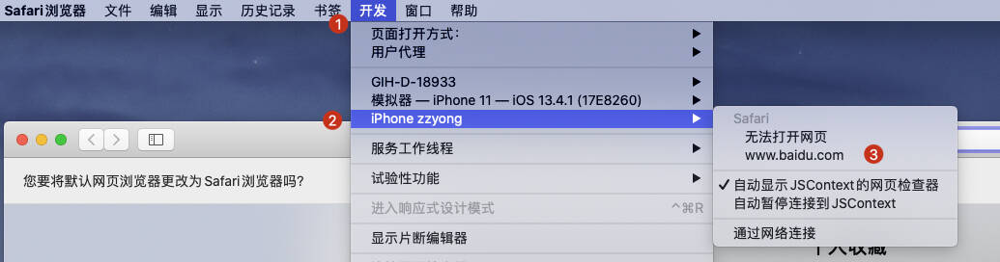

如果菜单栏没有**`开发`**选项，可以到左上角勾选开发菜单即可，具体设置步骤： **`Safari浏览器 -> 偏好设置 -> 高级 -> 在菜单栏中显示“开发”菜单`**

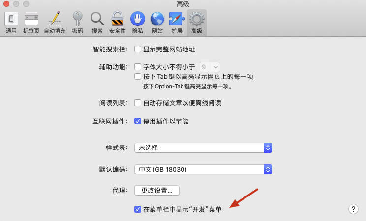

## 静态库调试
随着App业务的不断增加，业务会被拆分成很多模块。而这些模块通常都会提前编译成静态库，然后以静态库的形式集成到主工程。虽然静态库可以提高工程的编译速度，但是会在调试时缺失具体的调试信息，从而提高了调试难度。虽然你可以切换成源码模式方式解决此问题，但是这样非常麻烦。幸运的是，已经有人遇到这样的问题了，并且提出了具体的解决方案：[美团 iOS 工程 zsource 命令背后的那些事儿](https://tech.meituan.com/2019/08/08/the-things-behind-the-ios-project-zsource-command.html)

## 参考文档

1. [Debugging with Xcode](https://developer.apple.com/library/archive/documentation/DeveloperTools/Conceptual/debugging_with_xcode/chapters/about_debugging_w_xcode.html#//apple_ref/doc/uid/TP40015022-CH10-SW1)
2. [LLDB and Debugging
](https://developer.apple.com/library/archive/documentation/General/Conceptual/lldb-guide/chapters/Introduction.html#//apple_ref/doc/uid/TP40016717-CH1-DontLinkElementID_42)
3. [Advanced Debugging and the Address Sanitizer](https://developer.apple.com/videos/play/wwdc2015/413/)
4. [与调试器共舞 - LLDB 的华尔兹](https://objccn.io/issue-19-2/)
