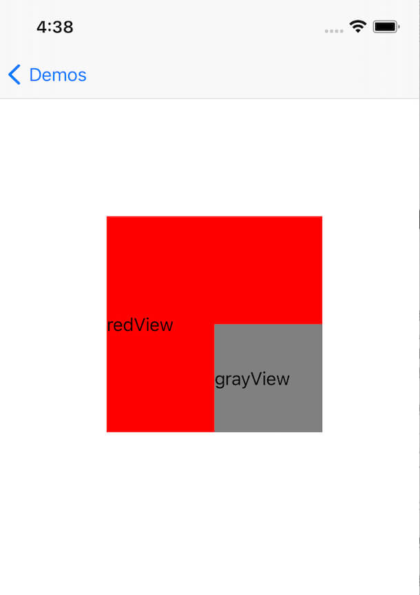

## iOS坐标转换

日常的业务开发中，经常会遇到坐标转换的问题，UIKit 框架提供了以下几种转换方法，下面简单做下说明和对比。

### 功能简介

将自己坐标系转换为另一个视图(toView)的坐标系

```objc
- (CGRect)convertRect:(CGRect)rect toView:(nullable UIView *)view;

- (CGPoint)convertPoint:(CGPoint)point toView:(nullable UIView *)view;
```

将另一个视图(fromView)的坐标系转换为自己的坐标系

```objc
- (CGRect)convertRect:(CGRect)rect fromView:(nullable UIView *)view;

- (CGPoint)convertPoint:(CGPoint)point fromView:(nullable UIView *)view;
```

### 转换例子

#### 目标
获取 `grayView` 在 `self.view` 中的坐标

#### 层级
grayView --> redView --> self.view

#### 预览


#### 代码
> bounds：自己本身的坐标系 (bounds 的 x, y 一定都等于 0 吗？有兴趣的可以试试 UIScrollView 滑动时的 bounds 值)
> 
> frame：父视图的坐标系

有 4 种方法可以获取到转换后的坐标，具体如下：

```objc
- (void)viewDidLoad {
    [super viewDidLoad];
    self.view.backgroundColor = UIColor.whiteColor;
    
    _redView = [UILabel new];
    _redView.text = @"redView";
    _redView.backgroundColor = UIColor.redColor;
    _redView.frame = CGRectMake(100, 200, 200, 200);
    [self.view addSubview:_redView];
    
    _grayView = [UILabel new];
    _grayView.text = @"grayView";
    _grayView.backgroundColor = UIColor.grayColor;
    _grayView.frame = CGRectMake(100, 100, 100, 100);
    [_redView addSubview:_grayView];
}

- (void)touchesBegan:(NSSet<UITouch *> *)touches withEvent:(UIEvent *)event {
    NSLog(@"redView convert grayView's frame to self.view %@", NSStringFromCGRect([_redView convertRect:_grayView.frame toView:self.view]));
    NSLog(@"grayView convert grayView's bounds self.view %@", NSStringFromCGRect([_grayView convertRect:_grayView.bounds toView:self.view]));
    
    NSLog(@"self.view convert grayView's frame from redView %@", NSStringFromCGRect([self.view convertRect:_grayView.frame fromView:_redView]));
    NSLog(@"self.view convert grayView's bounds from grayView %@", NSStringFromCGRect([self.view convertRect:_grayView.bounds fromView:_grayView]));
}
```

### 推荐
业务开发中推荐使用 bounds 进行坐标转换，更加简洁明了，不推荐 frame 方式

### 思考
转换后的坐标值是多少？

```objc
NSLog(@"grayView convert grayView's frame to self.view %@", NSStringFromCGRect([_grayView convertRect:_grayView.frame toView:self.view]));
```

### 测试代码
https://github.com/zhiyongzou/zzyNotes/blob/main/Demo/iOS/CommonTest/CommonTest/TestVcs/ConvertRectVC.m
