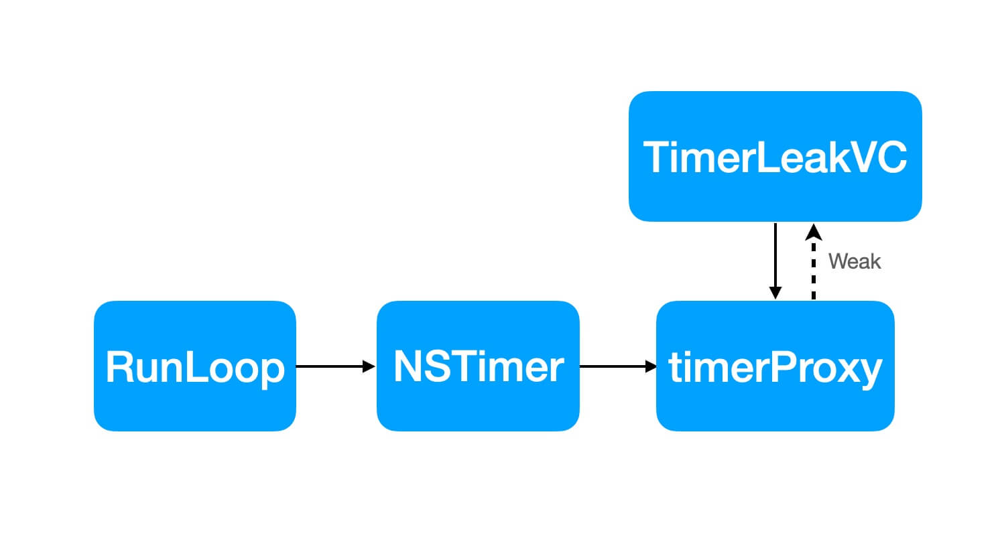

## 为什么 NSTimer 使用 target 方式回调可能会导致内存泄漏？

在日常的业务开发中，NSTimer 经常会用来做一些定时任务。对于重复执行任务的定时器，我们一般都会强引用定时器，并且在 dealloc 方法里面去失效（`[_timer invalidate]`）定时器。

但是我们发现目标对象的 dealloc 方法并不会调用，这由于定时器会强引用其目标对象，从而导致循环引用。其引用关系如下：

- timer 强引用 target
- target 强引用 timer

但是下面这种 `__weak timer __weak target` 的方式是否可以避免内存泄漏？

```objc
@interface TimerLeakVC ()

@property (nonatomic, weak) NSTimer *timer;

@end

@implementation TimerLeakVC

- (void)dealloc {
    [_timer invalidate];
    NSLog(@"%s", __func__);
}

- (void)helloWorld {
    NSLog(@"Hello World!");
}

- (IBAction)timerLeak:(UIButton *)sender {
    __weak typeof(self) weakSelf = self;
    _timer = [NSTimer scheduledTimerWithTimeInterval:1
                                              target:weakSelf
                                            selector:@selector(helloWorld)
                                            userInfo:nil
                                             repeats:YES];
}
@end
```

答案是：**否定的**

由于是 weak timer，所以 TimerLeakVC 和 timer 之间并不存在循环引用，但是为什么还是出现了内存泄漏？


### 原因分析

分析前先看一个示例代码，示例代码会输出什么日志？ 

```objc
- (IBAction)timerInOtherThread {
    dispatch_async(dispatch_get_global_queue(DISPATCH_QUEUE_PRIORITY_DEFAULT, 0), ^{
        [self performSelector:@selector(timerSay) withObject:nil afterDelay:0];
        NSLog(@"%s %@", __func__, [NSThread currentThread]);
    });
}

- (void)timerSay {
    NSLog(@"%s", __func__);
}
```

你会发现，上面只是打印出了：`-[TimerLeakVC timerInOtherThread]...`，这是为什么呢？这是因为：只有把定时器加到运行循环，它才可以正常触发任务。

至此我们知道**定时器（Timer）**也会被**主运行循环（Main Run Loop）**持有。

但是我们用的是 __weak target，理论上应该是不会强引用目标对象，这是为什么呢？我们看看官方文档对 target 参数描述如下：
> The object to which to send the message specified by aSelector when the timer fires. The timer maintains a strong reference to target until it (the timer) is invalidated.

从描述中得知 NSTimer 并不会判断 target 是 `__weak` 还是 `__strong`， 而是直接对其目标对象进行强引用，直到定时器失效。

> 其实`__weak`只是告诉编译器不要强引用（不插入 retain）😀，timer 内部并不会因为是 weak target 而放弃对其强引用

从上面的分析可得定时器的最终引用关系如下图所示：


**综上所述：**

主线程 RunLoop 是常驻对象，同时 NSTimer 也会保留其目标对象直至定时器失效才会释放目标对象。 由于目标对象被定时器持有，控制器无法释放，所以 dealloc 方法不会被调用，因此定时器也无法主动失效，最终导致内存泄漏。

### 解决方案
我们知道了导致内存泄漏的真正原因，那我们就可以对症下药。我们只要保证 NSTimer 不直接引用目标对象即可解决问题。下面介绍下三种解决方案

#### 方案 1
如果项目只支持系统版本 >= iOS 10，那么直接使用系统方法（带 block 回调）即可 

```objc
- (IBAction)timerDeallocBySystemApi:(UIButton *)sender {
    __weak typeof(self) weakSelf = self;
    _timer = [NSTimer scheduledTimerWithTimeInterval:1
                                             repeats:YES
                                               block:^(NSTimer * _Nonnull timer) {
        [weakSelf helloWorld];
    }];
}
```

#### 方案 2
目前大多数项目依然还支持 iOS 9 ,所以无法直接使用系统方法。既然无法使用，我们可以自己创建一个 block 回调方法即可。

**实现原理：**

将 NSTimer 类对象作为 timer 实例的 target 对象，然后用 timer 的 userInfo 来保存回调 block。具体实现如下：

```objc

@implementation NSTimer (Extension)

+ (NSTimer *)scheduledTimerWithTimeInterval:(NSTimeInterval)interval
                                    repeats:(BOOL)repeats
                                    forMode:(NSRunLoopMode)mode
                                      block:(void(^)(NSTimer * _Nonnull timer))block {
    
    // 将 NSTimer 类对象作为 target，这样子就可以完美的解决强引用 VC 的问题。由于 VC 不再被定时器引用，
    // 所以 VC 就可以正常释放了
    NSTimer *timer = [self scheduledTimerWithTimeInterval:interval
                                                   target:self
                                                 selector:@selector(blockInvoke:)
                                                 userInfo:[block copy]
                                                  repeats:repeats];
    
    [[NSRunLoop currentRunLoop] addTimer:timer forMode:mode];
    
    return timer;
}

+ (void)blockInvoke:(NSTimer *)timer
{
    if (!timer.isValid) {
        return;
    }
    void (^block)(NSTimer * _Nonnull) = timer.userInfo;
    if (block) {
        block(timer);
    }
}

@end

``` 

#### 方案 3
如果一定要用 target 方式去使用定时器，有没有办法解决呢？答案是肯定的。相信大家都听过这样一句计算机名言：`Any problem  in computer science can be solved by another layer of indirection`

我们只要增加一个中间目标对象，然后中间目标对象将消息转发对真正的目标对象，这就很好的解决了这个问题。而 OC 也专门干这种事的类：**NSProxy**

TimerTargetProxy 具体实现如下：

```objc
@interface TimerTargetProxy : NSProxy

@property (nonatomic, weak, readonly, nullable) id target;

- (instancetype)initWithTarget:(id)target;

@end


@implementation TimerTargetProxy

- (instancetype)initWithTarget:(id)target {
    _target = target;
    return self;
}

- (id)forwardingTargetForSelector:(SEL)aSelector {
    return _target;
}

@end

```

TimerTargetProxy 使用方式

```objc

_timerProxy = [[TimerTargetProxy alloc] initWithTarget:self];

- (IBAction)timerDeallocByWeakProxy:(UIButton *)sender {
    _timer = [NSTimer scheduledTimerWithTimeInterval:1
                                              target:_timerProxy
                                            selector:@selector(helloWorld)
                                            userInfo:nil
                                             repeats:YES];
}

```

他们之前的引用关系如下：




## 总结
从上面三种解决方案中，个人比较推荐方案 2，此外，苹果 iOS10 以后也给出跟 2 相同的方案。

测试代码：