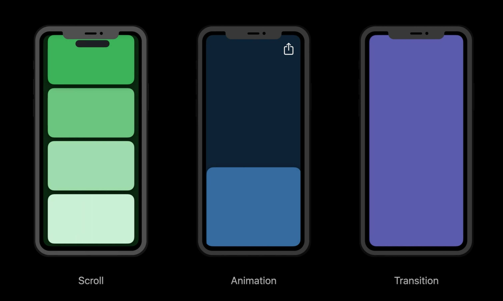
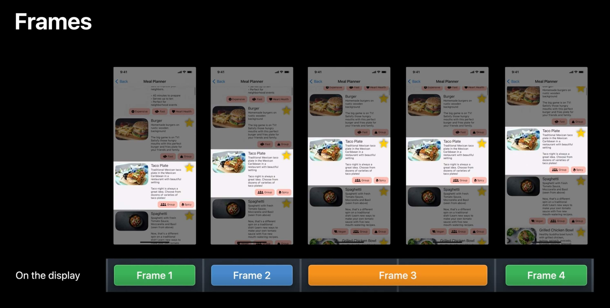
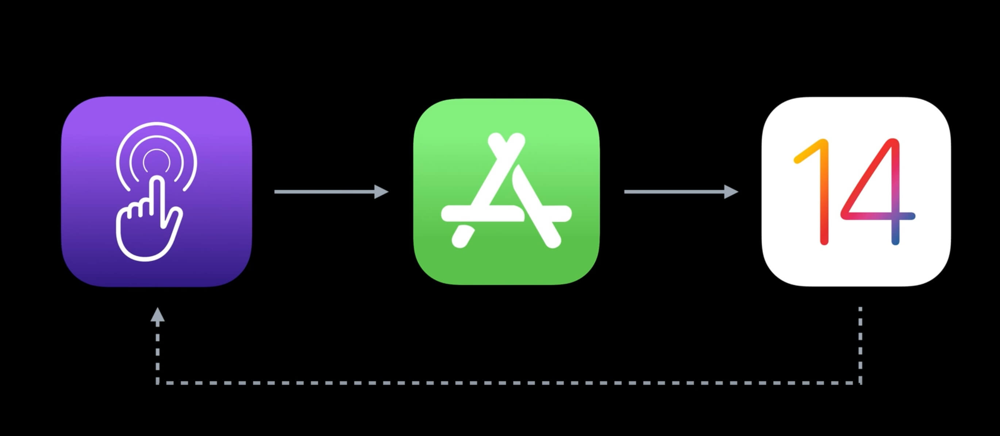
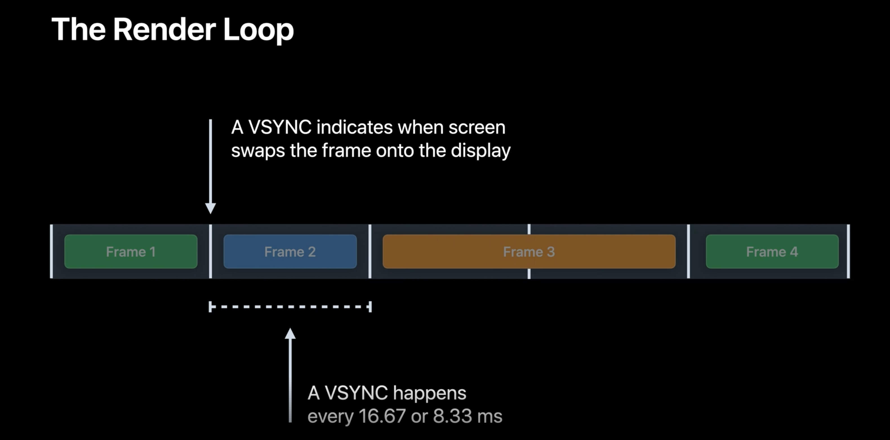
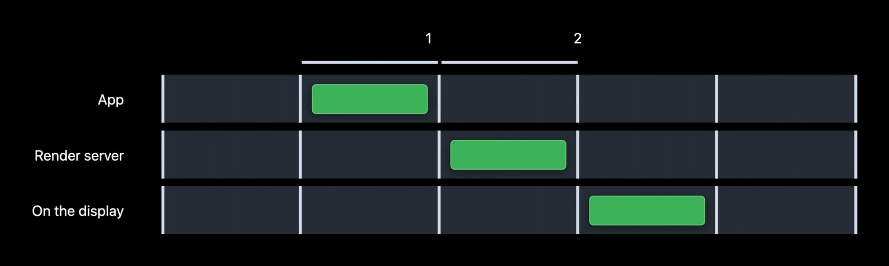
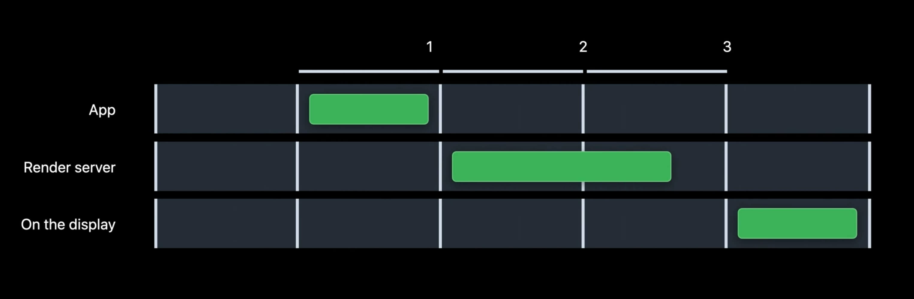
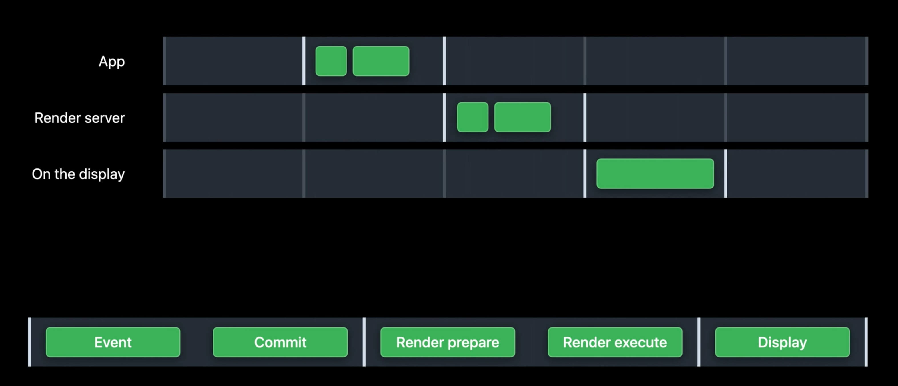
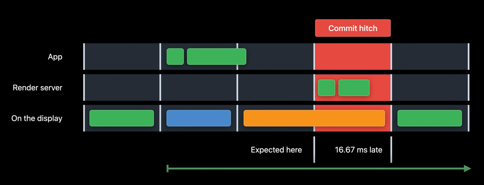
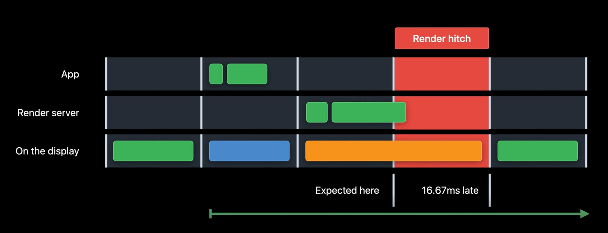

## 探索UI动画卡顿和渲染循环

### 什么是卡顿

任何时候屏幕出现晚于预计的帧都属于卡顿

App 卡顿场景示例：

- 列表滑动卡顿
- 分享按钮点击交互卡顿
- 视图转场卡顿

下面是一个列表滑动卡顿帧分解示例：

列表滑动过程中我们可以看出第 3 帧重复了，因为第 4 帧延迟了，用户就看到了卡顿

### 渲染循环

卡顿的出现是因为渲染循环没有按时完成一帧导致，什么是渲染循环？渲染循环是一个连续性过程，通过触碰事件传送给 App ，然后转化到用户界面，接着向操作系统传送最终呈现给用户的内容。

在每一帧的初始触发事件的硬件叫做 VSYNC，VSYNC 表示新帧必须准备就绪的时间。我们在显示轨迹上将它们标记出来，所以很容易看到截止期， 渲染循环和 VSYNC 的时间一致，它必须要始终命中检查点来让每帧都做好准备

在 iPhone 和 iPad 中 每秒有 60 帧，这意味着每 16.67 毫秒就可以显示一个新帧。

在 iPad Pro 上 刷新率是每秒 120 帧，这意味着每 8.33 毫秒就可以显示一个新帧

### 卡顿类型

### 卡顿测量