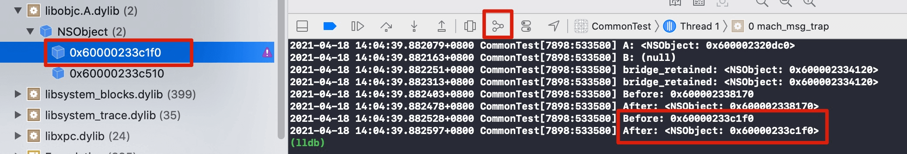

# ARC

ARC(Automatic Reference Countting)：自动引用计数，无需手动 retain 和 release，由编译器自动管理

## 内存管理方式
- 自己生成的对象，自己持有
- 非自己生成的对象，自己也能持有
- 不需要时释放自己持有的对象
- 不能释放非自己持有的对象

> 对象操作对应的OC方法

| 对象操作  | OC 方法  |
|---|---|
| 生成并持有对象  |  . alloc/new/copy/mutableCopy </br> . 使用 alloc/new/copy/mutableCopy 开头的方法，例如：newMyObject  |
| 持有对象  | retain  |
| 释放对象  | release |
| 废弃对象 | dealloc |

### 生成并持有 vs 生成不持有
- 生成并持有

```objc
+ (id)newMyObject 
{
    id obj = [NSObject new];
    return obj;
}
```

- 生成不持有

```objc
+ (NSArray *)array
{
  // 生成并持有
  NSArray *array = [[NSArray alloc] init];
  
  // 加入自动释放池，解除自己持有
  [array autorelease];
  
  return array;
}
```

### dealloc
- 无论 ARC 是否有效都不要显示调用 dealloc 方法
- dealloc 方法适用于移除代理或观察者对象

```objc
- (void)dealloc
{
    [[NSNotificationCenter defaultCenter] removeObserver:self];
}
```

- ARC 无效时，重写 dealloc 方法必须调用 [super dealloc]

```objc
// MRC
- (void)dealloc
{
    [super dealloc];
}
```

### id 和 void * 互转
ARC 有效时必须显示使用 `__bridge` 转换，否则会发生编译错误

```objc
// Error
{
    id obj = [NSObject new];
    // 隐式转换
    // Implicit conversion of Objective-C pointer type 'id' to C pointer type 'void *' 
    // requires a bridged cast
    void *p = obj; 
}

// Right
{
	id obj = [NSObject new];
	void *p = (__bridge void *)(obj);
	__unused id obj2 = (__bridge id)(p);
}

```

#### __bridge
- \_\_bridge 转换只是简单的赋值，中间不会涉及内存管理操作
- 安全性较低，如果不注意赋值对象的所有者，容易发生野指针错误

```objc
void *badAccess = nil;
{
    id obj = [NSObject new];
    badAccess = (__bridge void *)(obj);
}
NSLog(@"%@", (__bridge id)badAccess); // EXC_BAD_ACCESS
```

#### __bridge\_retained
\_\_bridge\_retained 进行类型转换的同时也会持有所赋值的对象

```objc
{
    void *bridge_retained = nil;
    {
        id obj = [NSObject new];
        NSLog(@"%@", obj);
        bridge_retained = (__bridge_retained void *)(obj);
    }
    NSLog(@"%@", (__bridge id)bridge_retained);
}
```

【注意!!!】上述示例代码会产生内存泄漏，需要主动释放 bridge_retained 

```objc
CFRelease(bridge_retained);
```

#### __bridge\_transfer
- 被转换变量所持有的对象在该变量赋值给转换目标变量后随之释放
- \_\_bridge\_transfer 不适用于 id 转 void * (Cast of Objective-C pointer type 'id' to C pointer type 'void *' cannot use \_\_bridge_transfer)

```objc
{
    id bridge_transfer = nil;
    {
        void *p = (__bridge_retained void *)([NSObject new]);
        NSLog(@"Before: %p", p);
        bridge_transfer = (__bridge_transfer id)(p);
    }
    NSLog(@"After: %@", bridge_transfer);
}
```

如果使用 \_\_bridge 代替 __bridge\_transfer 会发生内存泄漏问题，因为 ARC 对 void * 是无效的

```objc
{
    __weak id bridge_leak = nil;
    {
        void *p = (__bridge_retained void *)([NSObject new]);
        NSLog(@"Before: %p", p);
        bridge_leak = (__bridge id)(p);
    }
    NSLog(@"After: %@", bridge_leak); //正常来说是输出 nil，但这里不会，因为内存泄漏了
}
```

开启 Memory Graph 会发现内存泄漏了，如下图所示：




## ARC 禁用
- 通过设置`Objective-C Automatic Reference Counting` 为 NO，整个工程 ARC 无效


- 源文件(.m)增加编译器标记 `-fno-objc-arc` ，单一文件 ARC 无效


## ARC 所有权修饰符

### __strong
- \_\_strong 修饰符是 id 类型和对象类型的默认所有权修饰符
- 强引用，持有该对象

### __weak
- 弱引用，不会持有对象
- 解决循环引用问题
- 引用对象释放后，弱引用变量会失效并置 nil

```objc
NSObject __weak *obj = nil;
{
    NSObject *obj2 = [NSObject new];
    obj = obj2;
    NSLog(@"A: %@", obj);
}
    
NSLog(@"B: %@", obj);

// log 
2021-04-17 20:28:29.549221+0800 CommonTest[4804:211525] A: <NSObject: 0x600001ea4170>
2021-04-17 20:28:29.549325+0800 CommonTest[4804:211525] B: (null)
```

### __unsafe\_unretained
- 非安全所有权修饰符，不会持有对象
- \_\_unsafe\_unretained 修饰的变量编译器无法管理其内存
- 引用对象释放后，变量不会置 nil，容易发生野指针错误

```objc
NSObject __unsafe_unretained *obj3 = nil;
{
    NSObject *obj4 = [NSObject new];
    obj3 = obj4;
    NSLog(@"A: %@", obj3);
}
    
NSLog(@"B: %@", obj3); // Thread 1: EXC_BAD_ACCESS (code=EXC_I386_GPFLT)
```

### __autoreleasing
- 引用的对象会自动调用 autorelease 方法
- id的指针（id \*obj）或对象的指针(NSObject **obj)在没有显式指定时会被默认附加上 \_\_autorelease 修饰符

```objc
- (void)performSelectorWithError:(NSError **)error
{

}    
// 等同于
- (void)performSelectorWithError:(NSError * __autoreleasing *)error
{
    
}
```

- 无论 ARC 是否有效，调试时可使用 `_objc_autoreleasePoolPrint()` 打印注册到 autoreleasepool 上的对象

```objc
(lldb) po _objc_autoreleasePoolPrint()
```

## ARC Property
属性修饰符与所有权修饰符的对应关系

|属性修饰符|所有权修饰符|
|---|---|
|assign|__unsafe\_unretained|
|copy| __strong (赋值的是被拷贝的对象) |
|retain|__strong |
|strong|__strong|
|unsafe_unretained|__unsafe\_unretained|
|weak|__weak|

## 测试代码
https://github.com/zhiyongzou/zzyNotes/blob/main/Demo/iOS/CommonTest/CommonTest/TestVcs/ARCTestVC.m
