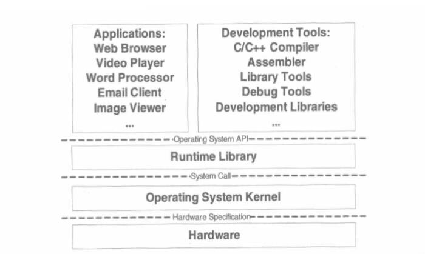

## 理论基础

1. 计算机三大核心部件：CPU、内存和I/O控制芯片

2. 计算机硬件结构框架图

    

    **北桥芯片**：北桥设计用来处理高速信号，通常处理中央处理器、存储器、PCI Express显卡（早年是AGP显卡）、高速PCI Express X16/X8的端口，还有与南桥之间的通信。

    **南桥芯片**：南桥设计用来处理低速信号，通过北桥与中央处理器联系

3. SMP与多核

    SMP：对称多处理"（Symmetrical Multi-Processing）简称SMP，是指在一个计算机上汇集了一组处理器(多CPU),各CPU之间共享内存子系统以及总线结构。它是相对非对称多处理技术而言的、应用十分广泛的并行技术

    CMP：单芯片多处理器（Chip multiprocessors，简称CMP），也指多核心。CMP是由美国斯坦福大学提出的，其思想是将大规模并行处理器中的SMP（对称多处理器）集成到同一芯片内，各个处理器并行执行不同的进程。与CMP比较， SMT处理器结构的灵活性比较突出。

4. 计算机名言

    Any problem in computer science can be solved by another layer of indirection

    计算机科学领域的任何问题都可以通过增加一个间接的中间层来解决

5. 计算机软件体系结构

    

6. 操作系统

    操作系统的一个功能是提供抽象的接口，另外一个主要功能是管理硬件资源

7. 线程

    线程（thread）是操作系统能够进行运算调度的最小单位

    同一进程中的多条线程将共享该进程中的全部系统资源，如虚拟地址空间，文件描述符和信号处理等等。但同一进程中的多个线程有各自的调用栈（call stack），自己的寄存器环境（register context），自己的线程本地存储（thread-local storage）

    线程调度中通常的三种状态：

    - 运行：线程正在运行
    - 就绪：线程随时可以运行，但CPU已被占用
    - 等待：线程正在等待某一件事（通常是I/O或同步）发生，无法执行

    线程类型

    - IO密集型线程：频繁等待的线程
    - CPU密集线程：很少等待的线程

    线程优先级改变方式

    - 用户指定优先级
    - 根据进入等待状态的频繁程度提升或降低优先级
    - 长时间得不到执行而被提升优先级

8. COW(Copy on Write)

    写时拷贝：指的是两个任务可以自由地读取内存，但任意一个任务视图对内存进行修改时，内存就会复制一份提供给修改方单独使用，以免影响到其他任务使用。
